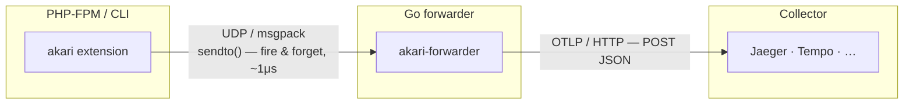

# Architecture

Akari is split into two cooperating components connected by a fire-and-forget
UDP channel, keeping the PHP hot path as cheap as possible.



Spans are serialized as compact msgpack and sent via UDP to the local Go
forwarder, which batches and forwards them to your OTLP collector. Because the
export is fire-and-forget UDP, the extension never blocks on the network — a
slow or absent collector cannot slow down PHP request handling.

Log records emitted with `Akari\log()` travel the same UDP path and are
forwarded to the collector's `/v1/logs` endpoint (spans go to `/v1/traces`).

## Why a separate forwarder?

- **Non-blocking PHP** — the extension hands off spans in ~1μs and returns to
  serving the request. Batching, retries, and HTTP are the forwarder's job.
- **Process-local aggregation** — many PHP workers send to a single forwarder,
  which batches across them before talking to the collector.
- **Decoupled protocol** — the wire format between extension and forwarder
  (msgpack/UDP) is independent of OTLP, so the collector side can evolve
  without touching the C extension.

## Production readiness

| Area | Status |
|------|--------|
| **Memory safety** | ASAN-verified, no leaks, bounded allocations |
| **Overhead when off** | Zero — `observer_init` returns `{NULL, NULL}` |
| **Exception tracking** | Engine-level hook catches all exceptions, even caught ones |
| **Extensibility conflicts** | Uses official `zend_observer` API — compatible with Xdebug, OPcache |
| **Cross-platform** | macOS (kqueue) + Linux (timer_create / SIGEV_THREAD_ID) |
| **Thread safety (ZTS)** | Full ZTS support via `ZEND_MODULE_GLOBALS` |
| **Span limit** | 256K spans max per request (overflow → warning + drop) |
| **Frame limit** | 64K deduplicated frames max |
| **Stack depth** | Clamped to 256, defaults to 64 |
| **SQL normalization** | Query fingerprinting for grouping in dashboards |

## Project structure

```
src/
├── profiler.h / profiler.c       # Core state + lifecycle
├── profiler_internal.h           # Shared internal declarations
├── profiler_span.c               # Frame dedup, span management
├── observer.c                    # zend_observer begin/end callbacks
├── hook_registry.c/h             # Modular hook registration system
├── hook_pdo.c                    # PDO instrumentation
├── hook_sqlite3.c                # SQLite3 (ext-sqlite3) instrumentation
├── hook_curl.c                   # curl instrumentation
├── hook_redis.c                  # Redis / RedisCluster / Relay
├── hook_mysqli.c                 # MySQLi (OO + procedural)
├── hook_oci8.c                   # Oracle OCI8
├── hook_memcached.c              # Memcached + Memcache
├── hook_elasticsearch.c          # Elasticsearch v7/v8 + OpenSearch
├── hook_predis.c                 # Predis (pure PHP Redis)
├── hook_grpc.c                   # gRPC
├── hook_rdkafka.c                # rdkafka
├── hook_soap.c                   # SOAP
├── hook_pheanstalk.c             # Pheanstalk / Beanstalkd
├── hook_graphql.c                # webonyx/graphql-php
├── hook_amqp.c                   # AMQP + php-amqplib
├── hook_php_streams.c            # HTTP stream wrappers
├── hook_pcre.c                   # PCRE regex functions
├── hook_io.c                     # Filesystem, password, APCu, DNS, shell, mail, sleep
├── hook_framework.c              # Symfony/Laravel route detection
├── hook_symfony.c                # Symfony components
├── hook_laravel.c                # Laravel components
├── hook_shopware.c               # Shopware 6 DAL + kernel
├── hook_doctrine.c               # Doctrine ORM
├── hook_twig.c                   # Twig templates
├── hook_error.c                  # Framework error handlers
├── hook_engine.c                 # Engine-level hooks (compile, GC, exceptions)
├── hook_root_span.c              # HTTP root span + W3C traceparent
├── php_akari.c                   # Module entry, INI, userland API
├── otlp_export.c                 # OTLP JSON serialization
├── udp_export.c                  # UDP/msgpack export
├── sql_normalize.c               # SQL normalization + truncation
└── msgpack_write.h               # Header-only msgpack encoder
forwarder/
├── cmd/akari-forwarder/          # Go entry point
└── internal/                     # Receiver, buffer, transform, forwarder
tests/
└── *.phpt                        # PHPT integration tests
```
