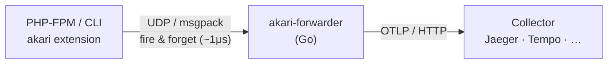

# Akari — 灯

  <em>A high-performance PHP APM extension. Automatic distributed tracing — exported as OpenTelemetry.</em>

!!! warning "Work in progress"

    This project is still a work in progress and is not yet ready for
    production use. APIs, configuration, and internals may change at any time.

**Akari** (灯, *"light"*) is a PHP C extension that illuminates your
application's behavior. It hooks into the Zend Engine via the official
`zend_observer` API to capture database queries, HTTP requests, cache and
messaging calls, framework internals, and exceptions — all exported as
standard OpenTelemetry traces to any OTLP-compatible collector (Jaeger,
Grafana Tempo, Honeycomb, etc.).

## Key design goals

-   :material-flash: __Zero-config__

    Drop in, get traces. Sensible defaults cover 90% of use cases.

-   :material-speedometer: __Near-zero overhead__

    Fire-and-forget UDP export, frame deduplication, and per-hook thresholds
    keep the hot path at roughly ~1μs.

-   :material-open-source-initiative: __No vendor lock-in__

    Standard OTLP protocol — point it at any collector you already run.

-   :material-puzzle: __Broad coverage__

    Databases, caches, HTTP clients, messaging, and the major PHP frameworks
    are instrumented out of the box.

## How it works

Spans are serialized as compact msgpack and sent via UDP to a local Go
forwarder, which batches and forwards them to your OTLP collector. Log records
emitted with `Akari\log()` travel the same UDP path and are forwarded to the
collector's `/v1/logs` endpoint (spans go to `/v1/traces`).

## Where to next

-   :material-rocket-launch: __[Quick start](getting-started/quick-start.md)__

    Get traces flowing in a few minutes with Docker.

-   :material-wrench: __[Installation](getting-started/installation.md)__

    Build the extension and forwarder from source.

-   :material-tune: __[Configuration](getting-started/configuration.md)__

    Every INI setting and recommended profiles.

-   :material-sitemap: __[Architecture](concepts/architecture.md)__

    How the extension, forwarder, and collector fit together.

## Requirements

- PHP 8.2+
- macOS or Linux
- Go 1.26+ (for the forwarder)

## License

Akari is released under the [MIT License](https://github.com/shyim/akari/blob/main/LICENSE).
